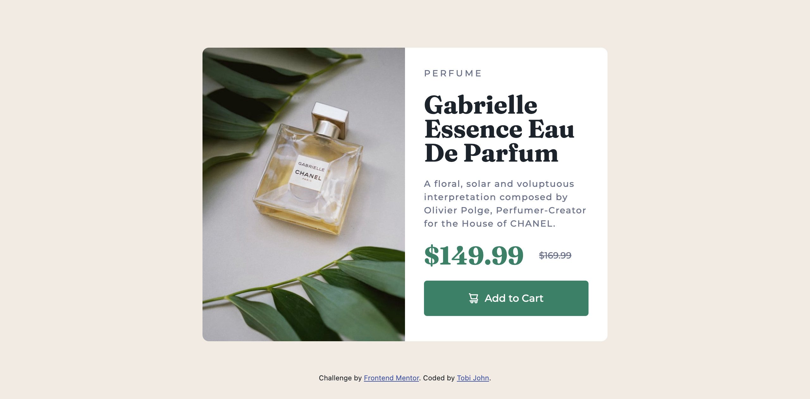

# Frontend Mentor - Product preview card component solution

This is a solution to the [Product preview card component challenge on Frontend Mentor](https://www.frontendmentor.io/challenges/product-preview-card-component-GO7UmttRfa). Frontend Mentor challenges help you improve your coding skills by building realistic projects. 

## Table of contents

- [Overview](#overview)
  - [The challenge](#the-challenge)
  - [Screenshot](#screenshot)
  - [Links](#links)
- [My process](#my-process)
  - [Built with](#built-with)
  - [What I learned](#what-i-learned)
  - [Continued development](#continued-development)
  - [Useful resources](#useful-resources)
- [Author](#author)

**Note: Delete this note and update the table of contents based on what sections you keep.**

## Overview

### The challenge

Users should be able to:

- View the optimal layout depending on their device's screen size
- See hover and focus states for interactive elements

### Screenshot

### Links

- Solution URL: (https://github.com/jurnwebdev/product-preview-card.git)
- Live Site URL: (https://vocal-sawine-ff9fa3.netlify.app/)

## My process

### Built with

- Semantic HTML5 markup
- CSS custom properties
- Bootstrap
- Flexbox
- Mobile-first workflow

### What I learned

I learnt how to use varaible in css. It was amazing having to be using "var(--Value)" instead the regular way of having to write everything in full. One major part i also figured out while working on this project is [background-position]. 
I was having issues with the "background-image" placement while switching from tablet mode to mobile mode. But with the help of w3schools and csstrick, I was able to place the backround image properly as the orientation of the screen changes.

### Continued development

I'm still yet to dive deep into assessibility in html. I used a few while working on this project and I'll keep practicing to improve better on it. Working on a more complex layout next to enhace my mobile first workflow skill.

### Useful resources

- (https://www.w3schools.com/html/html_accessibility.asp) - Introduced me to how web accessibility works.
- (https://css-tricks.com/almanac/properties/b/background-position/) - When i got stuck with background positioning while working on the responsivness, this article highled with examples on how to use background-position property in css.

## Author

- Website - [Tobi John](https://www.tobijohn.com)
- Frontend Mentor - [@jurnwebdev](https://www.frontendmentor.io/profile/jurnwebdev)
- Twitter - [@oga_Thobi](https://twitter.com/oga_Thobi)

